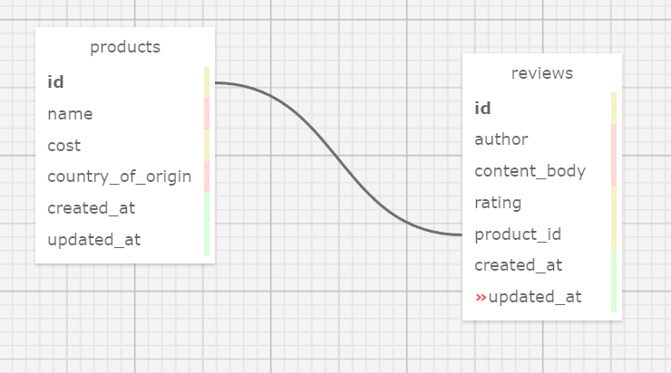

# _Super Mario's Super Foods!_

#### By _**Matt C.**_

#### _Epicodus' Ruby code review #4 on databases with Rails and user authentication and authorization with Devise._

## Description
_A sample MVP for displaying Mario's products and reviews of them. Now with user account functionality!_

## Database Schema

## Technologies Used
* _Ruby_
* _rspec_
* _pry_
* _[Docker](https://www.docker.com/)(optional)_
* _Rails_
* _Capybara_
* _PostgreSQL_
* _Shoulda Matchers_
* _Faker_
* _Active Record_
* _Devise_

## Using this app with Ruby 2.6.5 installed natively (no Docker)

* _Run_ `git clone https://github.com/catperso/marios-specialty-food-products` _in your terminal to clone this repository to your device, then navigate to the project directory._
* _Run_ `bundle install` _to package the Gems and set up Gemfile.lock._
* _Run_ `rake db:setup` _to set up the databases, tables, and seed them with placeholder entries._
* _Run_ `rspec` _if you want to run the model and Capybara integration specs._
* _Run_ `rails s` _to start a local server._
* _Open up your web browser and go to_ `http://localhost:3000` _while the server is running to experience the project._
* _See the **Testing Accounts** section for initial login information._

## Using this app with Docker

* _First make sure Docker is installed as per the official [instructions](https://docs.docker.com/get-docker/)._
* _Run_ `docker pull ruby:2.6.5` _to pull an image for the same version of Ruby this project was built with._
* _Run_ `git clone https://github.com/catperso/marios-specialty-food-products` _in your terminal to clone this repository to your device, then navigate to the project directory._
* _Run_ `docker-compose run web bundle install` _to bundle the gems and set up Gemfile.lock._
* _Run_ `docker-compose run web sh` _to start a shell inside the container._
* _Run_ `rake db:setup` _in the container shell to set up the databases, tables, and seed them with placeholder entries._
* _Run_ `rspec` _in the container shell if you want to run the model and Capybara integration specs._
* _In your normal terminal, run_ `docker-compose up --build` _to bundle the app and start up the database and server containers properly attached to eachother._
* _Open up your web browser and go to_ `http://localhost:3000` _while the server is running to experience the project._
* _See the **Testing Accounts** section for initial login information._

## Testing Accounts
_Seeding the databases also sets up the project with a user account and an admin account to test the various parts of the site. The email for the user (non-admin) is `user@epicodus.com`. The email for the admin is `admin@epicodus.com`. The password for each is `epicodus`._

## Known Bugs
* _None so far._

## License - [MIT](https://opensource.org/licenses/MIT)

_If you run into any problems/bugs feel free to send me an email [(mc.casperson@gmail.com)](mailto:mc.casperson@gmail.com) with details._

Copyright (c) _2022_ _Matt C._